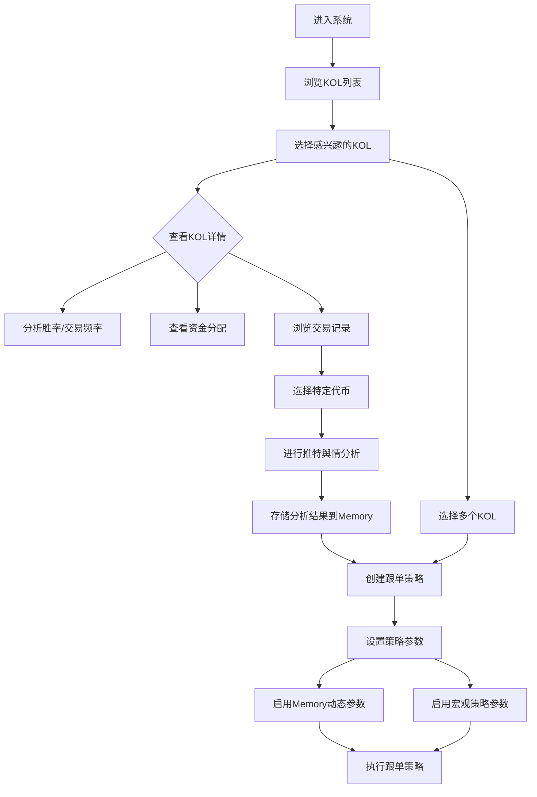

# MCP 辅助跟单系统 PRD

## 1. 概述

### 1.1 产品简介
MCP是一个专注于加密货币交易和KOL（关键意见领袖）管理的平台。该平台允许用户跟踪、分析和跟单KOL的加密货币交易活动，特别是专注于热门币种的投资机会。用户可以结合MCP的推特数据舆情分析能力，更精确地进行投资决策。

### 1.2 目标用户
- 加密货币投资者和交易者
- 希望跟踪和模仿成功KOL交易策略的用户
- 加密货币市场分析师和研究人员
- 需要舆情数据辅助决策的交易者

### 1.3 产品目标
- 提供直观的界面，展示KOL交易活动和绩效
- 允许用户创建和管理KOL关注列表
- 提供详细的交易数据分析和可视化
- 支持基于KOL策略的自动跟单功能
- 整合MCP推特数据舆情分析，增强决策准确性
- 利用Memory功能自动优化交易策略参数

## 2. 用户流程

### 2.1 核心用户流程
1. **KOL钱包地址管理**：平台维护一系列KOL钱包地址，用户可以浏览并查看这些地址的交易表现

2. **KOL选择**：用户从KOL列表中选择出一系列自己想要加入跟单策略的KOL地址

3. **KOL分析**：用户可以通过观察胜率分析/交易频率等页面来选择合适的KOL

4. **资金分配分析**：在资金分配页面，用户可以查看各KOL地址主要在哪些链上交易的土狗币

5. **交易记录查看**：点击"全部交易"跳转到该地址最新的交易记录（每页20条）

6. **舆情分析**：用户可以对感兴趣的代币进行MCP推特数据舆情分析
   - 与MCP交互的结果和数据分析会被存入服务器的Memory

7. **创建跟单策略**：用户回到KOL管理页面，多选KOL钱包地址，点击"新建跟单策略"
   - 在设置页面可勾选"推特 Memory 动态调整参数"和"宏观策略 动态调整参数"
   - 曾经执行过舆情分析的特定代币会被Memory所影响
   - 用户交互后反馈好的代币会使用更激进的策略买入/持有/卖出
   - 反馈差的代币则会使用更保守的策略买入/持有/卖出

### 2.2 用户流程图

## 3. 功能规格

### 3.1 KOL管理

#### 3.1.1 KOL列表功能
- 展示所有受跟踪的KOL，包括基本信息和绩效指标
- KOL信息包括：名称、头像、钱包地址、余额、盈利（金额和百分比）、30天交易数量、最近活动时间
- 支持选择一个或多个KOL进行操作
- 提供按照不同指标排序的功能
- 快速访问KOL全部交易记录的链接按钮

#### 3.1.2 KOL关注列表
- 允许用户将选中的KOL添加到个人关注列表
- 关注列表数据保存在本地存储中
- 提供单独的关注列表视图

#### 3.1.3 KOL统计数据
- 选择单个KOL后显示详细统计信息
- 统计数据包括成功率、交易频率、持仓时间和资金分配

#### 3.1.4 KOL跟单策略
- 支持基于选定KOL创建新的跟单任务
- 链接到模拟器/策略创建页面
- 自动将选定KOL的钱包地址填充到创建页面中
- 支持同时选择多个KOL进行跟单

### 3.2 交易数据分析（Twitter页面）

#### 3.2.1 KOL交易代币列表
- 显示KOL交易的代币列表
- 每个代币显示操作类型（买入/卖出）、名称、余额、买入金额、利润、时间
- 提供区块浏览器链接查看交易详情
- 支持搜索特定代币

#### 3.2.2 代币详情
- 选择代币后显示详细信息
- 包括代币名称、价格、市值
- 提供关键指标：持仓、当前价值、买入价、当前价格、涨跌幅

#### 3.2.3 价格图表
- 显示选中代币的价格走势图表
- 包含烛台图表展示价格变动
- 标记KOL的买入/卖出点位
- 简化设计，专注于重要信息展示

#### 3.2.4 交易详情
- 显示交易细节，如交易时间、操作类型、价格、数量
- 支持链接到区块链浏览器查看交易详情

### 3.3 MCP推特数据舆情分析

#### 3.3.1 代币舆情分析功能
- 允许用户对特定代币进行MCP推特数据舆情分析
- 分析结果会影响该代币在跟单策略中的参数调整
- 与MCP的互动和分析结果存入服务器的Memory

#### 3.3.2 Memory数据应用
- 通过Memory优化交易策略参数
- 基于历史交互结果和舆情分析调整买入/持有/卖出策略

### 3.4 策略创建与管理

#### 3.4.1 策略创建页面
- 支持创建新的跟单策略
- 自动填充选定KOL的钱包地址
- 提供买入/卖出设置选项

#### 3.4.2 策略参数动态调整
- **推特 Memory 动态调整参数**：基于MCP交互结果调整策略参数
  - 对反馈好的代币使用更激进的策略
  - 对反馈差的代币使用更保守的策略
- **宏观策略 动态调整参数**：基于宏观市场趋势调整策略参数
  - 在牛市使用更激进的买入/持有策略
  - 在熊市使用更保守的买入/卖出策略

## 4. 用户界面规格

### 4.1 设计风格
- 采用现代深色模式UI
- 深色背景配高对比度文本
- 青绿色/水绿色强调色(#00FF9D)用于按钮和高亮
- 最小化设计美学，注重清晰的边界、微妙的阴影和平滑过渡

### 4.2 按钮样式
- 常规按钮：深色半透明背景，带有微妙边框
- 活跃/特殊按钮：青绿色背景配白色文本
- 悬停效果：轻微缩放(1.02)而不改变颜色

### 4.3 标签样式
- 活跃标签：青绿色背景配白色文本
- 非活跃标签：深色背景配浅灰色文本
- 悬停：文字变亮为白色

### 4.4 表格样式
- 清晰的行分隔，使用深灰色边框
- 悬停效果显示为稍亮的背景色
- 选中行高亮显示
- 图标按钮用于操作列

### 4.5 图表样式
- 简洁的烛台图表
- 移除不必要的元素如成交量指标和额外的价格注释
- 在x轴上添加基本时间标记以增强清晰度
- 突出显示买入/卖出标记点

### 4.6 开关与控件
- 切换开关使用青绿色(#00FF9D)表示开启状态
- 滑块与范围选择器使用一致的颜色主题
- 信息图标与悬停提示提供上下文帮助

## 5. 技术规格

### 5.1 前端框架
- 基于Next.js应用框架
- 使用React组件构建用户界面
- 采用TypeScript确保类型安全

### 5.2 UI组件
- 使用Lucide图标库
- 自定义组件：Button, Card, Input, Tabs等
- 响应式设计，支持不同屏幕尺寸

### 5.3 数据存储
- 本地存储用于保存用户首选项（如关注列表）
- 服务器存储用于保存Memory数据和舆情分析结果
- 预置的演示数据用于展示功能

### 5.4 集成
- 与区块链浏览器整合（如Etherscan/BSCscan）
- MCP推特数据舆情分析API集成
- Memory系统集成，用于智能策略调整

### 5.5 实现状态与API集成需求

#### 5.5.1 当前实现状态
- 目前的实现以前端demo为主
- 后端API未接入，大部分使用mock数据
- KOL列表使用真实钱包地址

#### 5.5.2 待接入后端API
- **链上数据API**：GMGN或其它提供钱包链上地址/最新交易的数据服务
- **图表数据**：对应代币的卖出点位图TradingView集成
- **舆情分析**：MCP agent + Twitter API endpoint
- **Memory存储**：后端储存MCP agent执行memory的数据解决方案
- **跟单系统**：
  - dbot模拟器跟单API和请求参数
  - 接口文档参考：https://guide-zh.dbotx.com/dbot-developer/dbot-apis/simulator-bot-api/create-simulator-copy-trading
  - 后期实现正式API需考虑速率限制
  - 评估是否需自建/使用自有RPC节点
